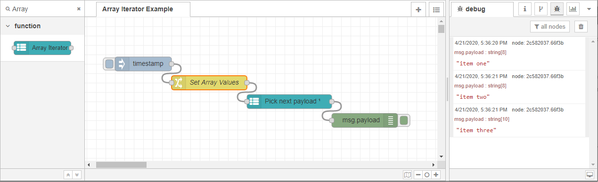

# Array Iterator

  

Given an array input, when this node is executed it will pass the “next” value
of the array to the succeeding connected node(s).

## Install

`cd ~/.node-red && npm install --only=prod @tmus/node-red-contrib-array-iterator`

## Usage

Drag and Drop the "Array Iterator" onto the canvas. Set the `Input` value to the
source array and the `output` value to the destination property. Optionally, you
can enable `Repeat` to go back to the beginning of the array after the end is
reached.

### Example

The [example](./example-flow.json) iterates through the three items in the array
then stops. To see it in action, [import
it](https://nodered.org/docs/user-guide/editor/workspace/import-export) into
your Node-RED project.

